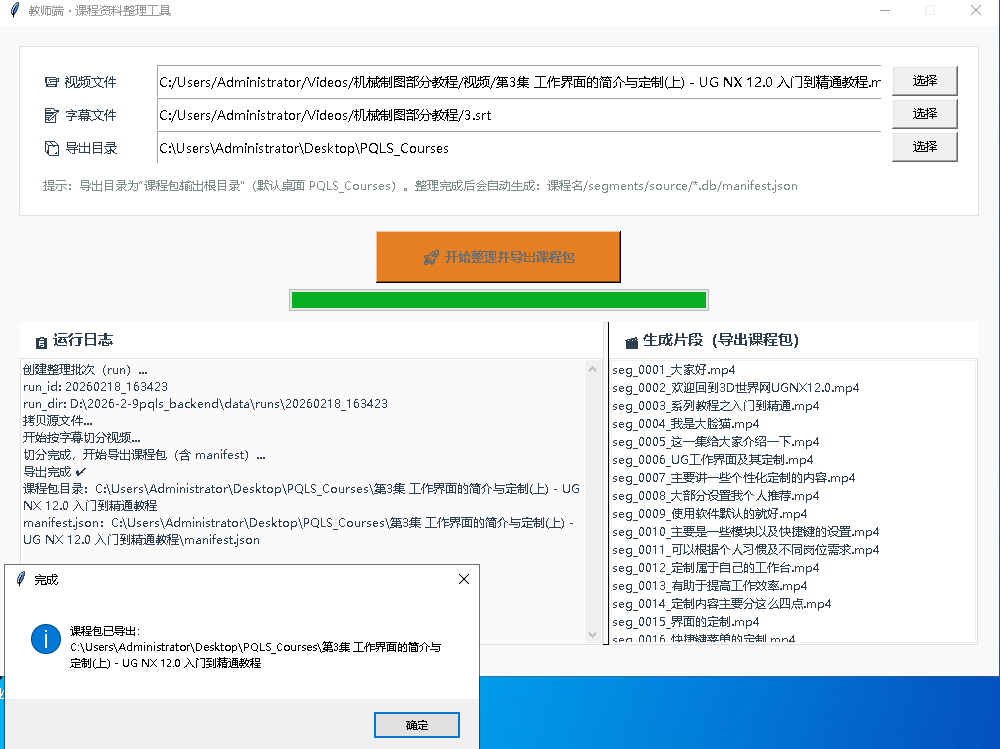
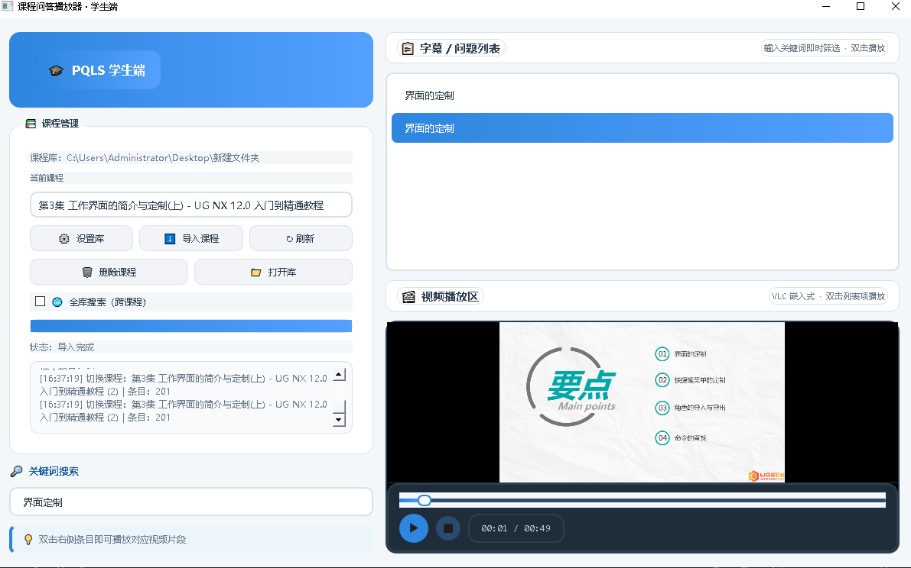

# PQLS-Lite
系统=离线课程包：字幕切片 + 全库搜索 + 播放

## Why PQLS-Lite
Traditional long video courses are hard to navigate. PQLS-Lite turns videos into searchable micro-segments, so learners can jump directly to the explanation clip instead of scrubbing the timeline.
**Pain point:** Subtitles alone don’t solve retrieval. Learners still need a fast, reliable mapping from a query to the exact video segment—especially across multi-episode courses.  
**Solution:** PQLS-Lite builds an offline segment index from video + SRT, then enables instant keyword/semantic search and one-click playback of the matched clip.

# PQLS-Lite
PQLS-Lite 是一个“离线课程包 + 字幕切片检索 + 一键播放”的轻量学习系统：老师把视频+字幕切成课程包，学生端可输入关键词/语义检索，直接跳到对应讲解片段.

2）核心特性（最重要）
## Features
- ✅ Teacher 端：导入视频 + SRT → 自动切分片段 → 生成课程包（含 manifest / questions.db / course.db / segments）
- ✅ Student 端：导入课程包 → 右侧字幕/问题列表即时筛选 → 双击播放对应视频片段
- ✅ 支持“跨课程全局搜索”（多集课程一起查）
- ✅ 可选：离线语义检索（Instructor-XL），对“加了语气词/助词”的表达更友好
- ✅ 全离线运行：课程包可拷贝分发，无需联网（语义模型下载/缓存可离线拷贝）

3）适用场景
## Use Cases
- 机械/UG/编程等“长视频教程”：学生遇到问题直接搜关键句，秒定位到讲解片段  
- 教师课后复盘：按知识点快速回看对应片段  
- 线下培训/公司内训：U盘/网盘分发课程包，学员端离线检索与播放

4）快速开始（不打包版，最符合你现在阶段）
## Quick Start (Source)
> Python 3.10+ recommended

### 1) Install dependencies
```bash
pip install -r requirements.txt
pip install -r student/requirements.txt

2) Run Teacher GUI
python teacher/teacher_gui.py

3) Run Student GUI
python student/student_gui.py

6、语义检索

## Optional: Offline Semantic Search (Instructor-XL)
Semantic search helps when the query wording differs slightly from subtitles (e.g. “打开草图的环境” vs “打开草图环境”).

Model directory example:
- student/models/instructor-xl/

Index directory example:
- student/nlp/index/

Build index (example):
```bash
python -m nlp.build_index --courses_dir "D:\PQLS_Courses" --model_dir "D:\...\student\models\instructor-xl" --device cuda

english:


### 7）FAQ（你这项目很需要）
```md
## FAQ
**Q: Why no results after importing?**  
A: Make sure the course folder contains a non-empty `questions.db` (Teacher generates it).

**Q: Do students need VLC?**  
A: Recommended. Student player uses VLC embedded mode for best compatibility.

**Q: Can I put course packages anywhere?**  
A: Yes. Student selects a local “course library folder” (e.g. `PQLS_Courses`) and imports course packages into it.

ROADMAP:

## Roadmap
- [ ] Release: prebuilt Windows portable package (Teacher / Student)
- [ ] Better duplicate course detection (optional)
- [ ] Improve semantic query normalization (stopwords / punctuation / synonyms)
- [ ] One-click “Rebuild Index” button (for semantic search)


PQLS-Lite is an offline “course pack” workflow for learning from long videos:
**Teacher** cuts video into searchable segments with subtitles → exports a **Course Pack** → **Student** imports packs and searches across courses, then plays the matched segment.

## Screenshots

### Teacher (课程包制作端)


### Student (学习端)



PQLS-Lite 是一个离线“课程包”工作流：
**教师端**把“视频+字幕”切成可检索的小片段并导出课程包 → **学生端**导入多个课程包并全库搜索，点击即播放对应片段。

---

## Features / 特性

- Teacher-side course pack export (video segments + SQLite DB + manifest validation)
- Student-side import multiple course packs, global search, click-to-play
- Optional semantic search (Instructor-XL) as an enhancement module
- Offline-first, works well for classrooms / LAN / low-network environments

---

## Course Pack Structure / 课程包结构

<course_name>/
segments/
source/
course.db
questions.db
manifest.json
.pqls_meta.json (optional)

Student imports **only** valid course packs (manifest validation).

---

## Dependencies / 依赖

- Windows 10/11 + Python 3.10
- ffmpeg/ffprobe/ffplay under project root `bin/`
- VLC player installed (student-side embedded playback)

---

## Quick Start / 快速开始

### Teacher / 教师端
1) Put ffmpeg binaries into `bin/`
2) Run teacher GUI:

```powershell
cd teacher
python teacher_gui.py
Student / 学生端

Run student GUI:

cd student
python student_gui.py


First run will ask to choose a Course Library folder (e.g. Desktop\PQLS_Courses).
Index Rebuild / 索引重建（逻辑说明）

Index is a reproducible cache built from course packs.
After importing new course packs, rebuild the index to include new content in semantic search.

(Implementation is provided under student/nlp/.)
License

MIT (or your choice)


保存关闭。

---

## 提交 README 并推送（两行）
```powershell
git add README.md
git commit -m "docs: add README"
git push